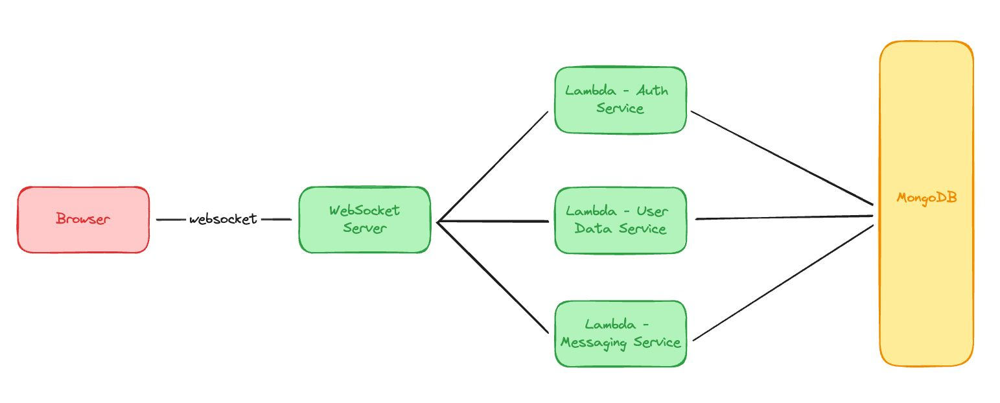

# Gigradar - Chat

This is app is stateless with microservices (so can easly deploy seperate and intergrate with lamda)

- Message Service
- Auth Service
- User Service
- Websocket
- Web (frontend)

For the Software Architecture like this


The user will be login first, then has a token that passing to websocket for connection to other microservices

## Running The Program

You can running the program using docker-compose or run directly using turborepo cause this is monolith web

but before running the application, you need to make sure for the .env value in every apps, i already declare the .env.example so you can copy and remove .example the .env (if you forgot, i was already make config.ts for declare defalut value of .env)

Note: In my case, i using WSL for running this app, if you run the app using docker-compose maybe you need to find your WSL IP address so the services can interact with other services

for checking that, you can use `wsl hostname -I` in command prompt windows (this for Websocket tho, i need to using that IP)
Reference : https://github.com/postmanlabs/postman-app-support/issues/11204

### Using Docker Compose

For Running this program, you install docker-compose first then running this syntax:

```
docker-compose up
```

### Using Turborepo

For Running using turborepo, first you need to install all the package by using this syntax

```
pnpm install
```

you can use npm, or yarn, but in my case i using pnpm cause fast to run

Then u can run all of the service and web by using this syntax

```
pnpm run dev
```

## Docker Repository

Auth Service
https://hub.docker.com/r/krisnadwipayana/gigradar-auth

Message Service
https://hub.docker.com/r/krisnadwipayana/gigradar-message-service

User Service
https://hub.docker.com/r/krisnadwipayana/gigradar-user-service/tags

Websocket
https://hub.docker.com/r/krisnadwipayana/gigradar-websocket

Web
https://hub.docker.com/r/krisnadwipayana/gigradar-web/tags

## Suggestion for the next

better using kafka for message send from one service to other services
Redis for storeing temporary data, can using for temporary state between same service (cause stateless services)
